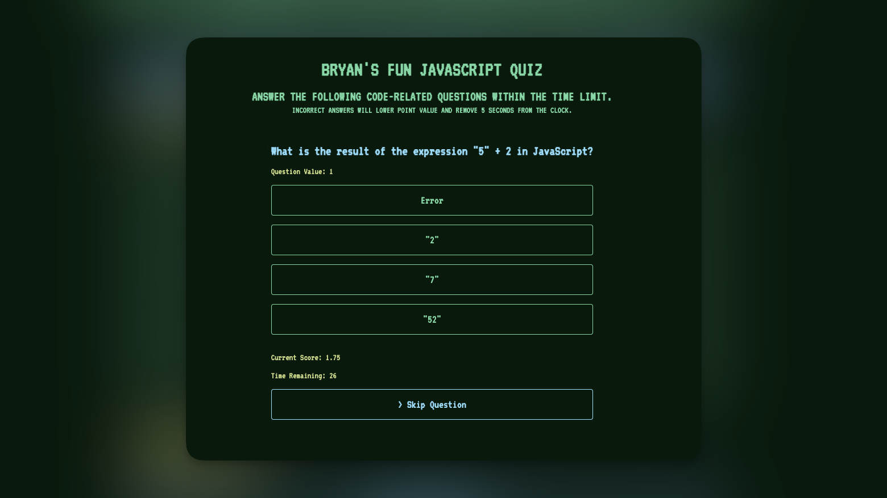

# Javascript Quiz
## User Story
`AS AN` coding boot camp student  
`I WANT` to take a timed quiz on JavaScript fundamentals that stores high scores  
`SO THAT` I can gauge my progress compared to my peers  

## Acceptance Criteria
`GIVEN` I am taking a code quiz  
`WHEN` I click the start button 
`THEN` a timer starts and I am presented with a question 
`WHEN` I answer a question  
`THEN` I am presented with another question 
`WHEN` I answer a question incorrectly 
`THEN` time is subtracted from the clock 
`WHEN` all questions are answered or the timer reaches 0 
`THEN` the game is over 
`THEN` I can save my initials and score 

## Overview
The goal of this project is to create a web application that allows users to take a Javascript Quiz. The application is designed to run for 60 seconds. There are 20 questions total. The app runs in the browser and features dynamically updated HTML and CSS powered by Javascript. 

## Javscript Technologies Used 
* setInterval
* localStorage
* Functions 
* DOM Methods 
* Loops
* Objects

## Deployment
I have deployed my Javascript Quiz on the web to make it live and accessible. You can view and test yourself by following this link: [Javascript Quiz](https://briimcfly.github.io/javascript-quiz/)

## Reflection 
This project has allowed me to apply the core skills I have recently learned and put them into practice. During development, I had the opportunity to deepen my understanding of the localStorage property, setInterval method, and Object Arrays . Additionally, I developed a deeper appreciation for for the importance code commenting, and the development principal DRY. (Don't repeat yourself). In the future, I would like to spend more time improving the design of the page. 